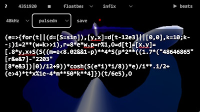

# aether algorhythm - 256b bytebeat - Lovebyte 2023

This repository contains the source code for the 256b bytebeat song "aether
algorhythm", made by pestis / brainlez Coders! and released at Lovebyte 2024
256b bytebeat music compo.

Should be played with the following settings:
- floatbeat
- infix
- 48 kHz

Greets to: superogue, TomCat, gopher, jobe, HellMood, psenough, jeenio, Řrřola,
p01, nesbox, okkie, exoticorn, baze, Virgill, byteobserver, ferris, Ped7g,
Dresdenboy, aldroid, hannu, wrighter, dave84, havoc, unlord, noby, LJ, PoroCYon,
sensenstahl, Blossom, deater, ilmenit, Fready, Jin X, gasman, DevEd, bitl,
wbcbz7, teadrinker, Pellicus, GoingDigital, las, mentor, iq, blueberry, fizzer,
gargaj, pOWL, silvia, MartiniMoe, NR and everyone at the Sizecoding discord!

Listen on the
[dollchan](https://dollchan.net/bytebeat/#v3b64JVDBboMwFPuXSEV5rwGSlNJsXTjuWmkcaQ60fdMQZSCIVKrSf1+qXSzZlm3JD3buL8TeGSdbPL77kftl4RdbOVHaqfkFUd3F7Oyl8iurNG3cslRSSCdaq+S+jeP94WU6W83iHjAxGALrkpecd5Y+TCJ1FKl4AMQMSz6gRuRcJTvkR5aZPMtNvj2yaowo2rn4yLSWm8ANUrRxsEhIlV6/AeC5n35CLWED2KQmKARpg5ioVK85FRmgx3mlKM6wQ9xKbMOmg8a+Jm+2LQoFYrShGW9isONKPYH7NKctiAMTbKq74UpftQ+HZEZKKVj3/87nta/9iWrPnn8)
or the
[greggman](https://greggman.com/downloads/examples/html5bytebeat/html5bytebeat.html#t=1&e=0&s=48000&v=pulsedn&bb=5d00000100fb0000000000000000141943a3e33e13a131d2d7b8d7492b38bac4bc906fe2cbac0a331c813aacaaaa3e591fe886d912280e00b0b69fa5fa7efa45cc5ac7a3da39430349fa7ff3d4e69f5c165650e7698c64937c1ea0897d86dcf398950b554338b1210cc13816f2e860dc9b497780f186758655b31588e023f7cc2f37efc82f2877a627374b8e7c2347feb7a68bc6fc63278769595cd5cfedd34c1b455b94b0ae336b4e16e598338a2120f7a344630990d5c619e32c8f974d60eab20dd1533419cb79652610410258445ba21f61e77af70b77c416845362b2c9fdbc4d5941d9991e7f06288b4b7290fed4c300)
bytebeat player.

The source is commented to explain what each line does.

The javascript was minified with
[UglifyJS](https://skalman.github.io/UglifyJS-online/).

Note that in the greggman version the delay buffer is implemented without a ring
buffer, because greggman player does not guarantee that the function is called
always in time order, probably due to the visuals. That fix actually allows
saving 2 bytes, but now leaks memory: the delay buffer just keeps on growing all
the time. But modern computer should not run out of memory in the duration of
the song.

